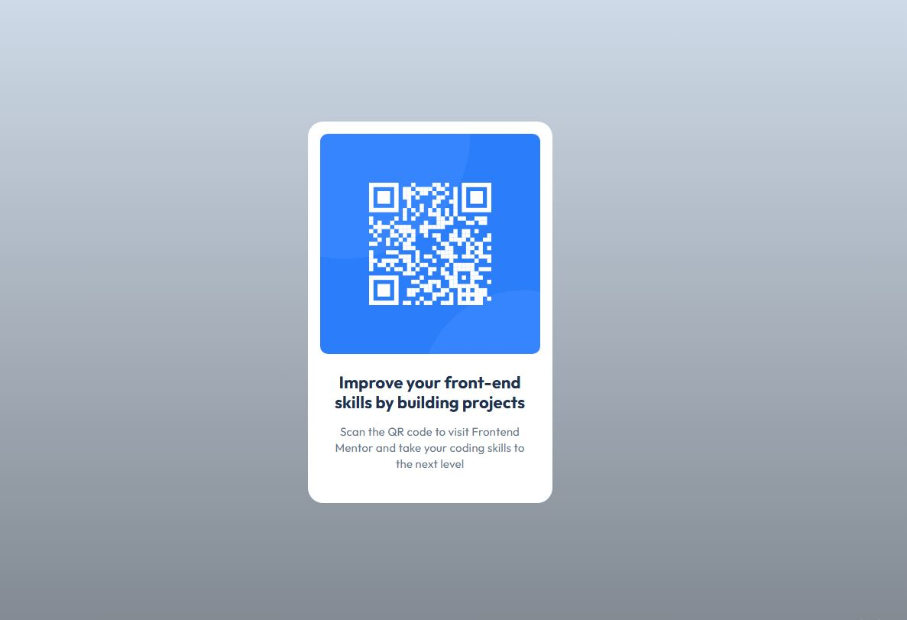

# Frontend Mentor - QR code component solution

This is a solution to the [QR code component challenge on Frontend Mentor](https://www.frontendmentor.io/challenges/qr-code-component-iux_sIO_H). 

## Overview

### Screenshot

- Solution URL: [https://github.com/AnnaRodi/qr-code-component-main]
- Live Site URL: [https://annarodi.github.io/qr-code-component-main/]

### Built with

- Semantic HTML5 markup
- CSS custom properties
- Flexbox
### What I learned
figma and css var

I'm glad I was able to use variables for the flowers and align the container. I didn't quite figure out the last one.

it was difficult to align the text with the template, the code from figma helped a lot.
and it was quite difficult to figure out github

I would appreciate explanations of how and in what order to make borders and styles. For example, in this project the text is in two blocks h1 and p, and part of the code for them is repeated - is it necessary to somehow combine the repeating code or is it better to make a separate style block for each element, and let them partially repeat each other.